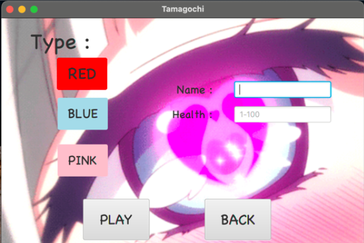

# puffugotchi
## Game as tamagotchi, but with Puff character as a main hero)
#### Write with JavaFX, Maven, Java 15, SceneBuilder, MySQL

## Requirements and dependencies.
Build and run with maven/javafx
## How to play
Choose your color, write your name and health
Click on button play!

Or you can load your previous game

In game menu you should click on buttons with food and water to feep your Puff alive

In setting menu you can set sound and levels

Be carefull with volume! Have a nice by-time)
